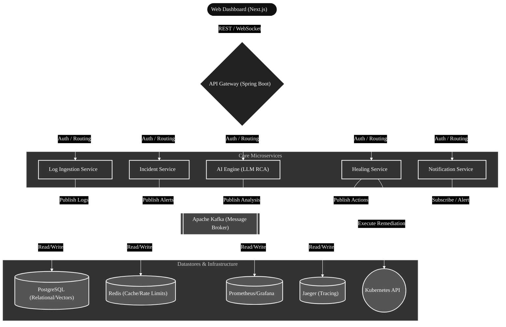
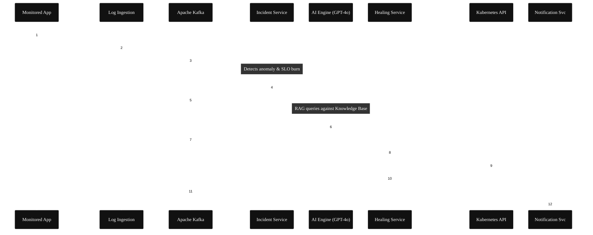
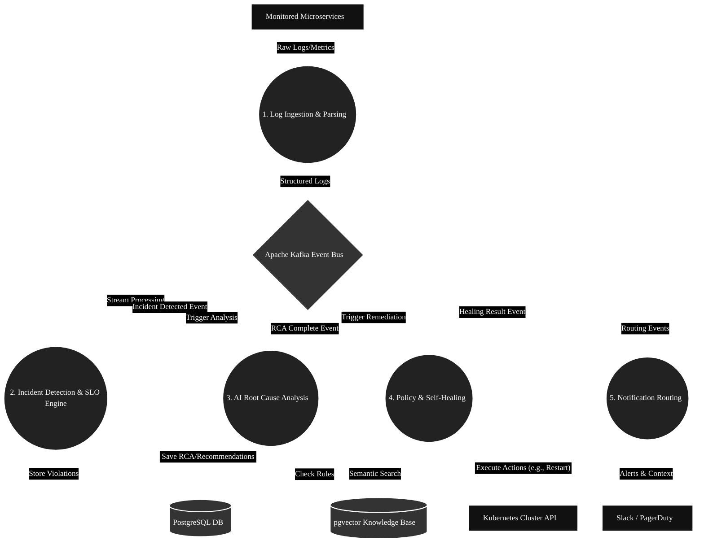
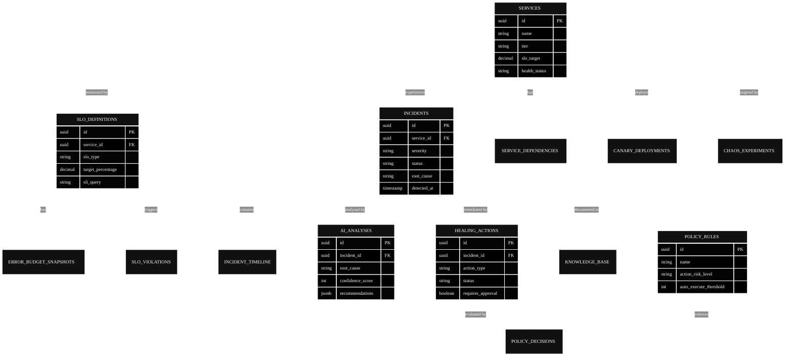

# Autonomous AI SRE Platform

<div align="center">


**An enterprise-grade, AI-powered Site Reliability Engineering platform that autonomously monitors microservices, detects incidents, performs AI-driven root cause analysis, and executes self-healing remediation workflows.**

</div>

---

## Architecture

### 1. High-Level System Architecture



### 2. Autonomous Incident Resolution Sequence



### 3. Data Flow Diagram (DFD)



### 4. Database Schema (ER Diagram)



## Features

### Core Platform
| Feature | Description |
|---------|-------------|
| **Log Ingestion** | Kafka-based pipeline parsing JSON, logfmt, and plaintext logs |
| **Incident Detection** | Statistical anomaly detection with alert correlation and dedup |
| **AI Root Cause Analysis** | LLM-powered RCA with RAG knowledge base and confidence scoring |
| **Self-Healing Engine** | Pod restart, scaling, rollback, cache clear via Kubernetes API |
| **Notification Service** | Slack, email, PagerDuty with configurable routing rules |

### Advanced Features
| Feature | Description |
|---------|-------------|
| **SLO & Error Budget** | Google SRE multi-window burn rate alerting with budget forecasting |
| **Service Dependency Graph** | DAG-based blast radius analysis and critical path identification |
| **AI Guardrails & Policy Engine** | Risk matrix scoring with confidence gates and approval workflows |
| **Feature Flag Management** | Consistent hashing rollouts, kill switches, and canary flags |
| **Distributed Tracing** | OpenTelemetry + Jaeger with request journey visualization |
| **Canary Deployments** | Progressive traffic shifting with automated SLO-based rollback |
| **Event Replay System** | Replay incidents for debugging with time-travel simulation |
| **Chaos Engineering** | Pod kill, network latency, CPU stress experiments |

## Tech Stack

| Layer | Technology |
|-------|-----------|
| Language | Java 21 (Virtual Threads, Records, Pattern Matching) |
| Framework | Spring Boot 3.3, Spring Security, Spring Data JPA |
| Messaging | Apache Kafka (KRaft mode) |
| Database | PostgreSQL 16 + pgvector |
| Cache | Redis 7 |
| AI | LangChain4j + OpenAI GPT-4o |
| Kubernetes | Fabric8 Java Client |
| Observability | Prometheus, Grafana, OpenTelemetry, Jaeger |
| Frontend | Next.js, TypeScript, Tailwind CSS |
| Infrastructure | Docker, Kubernetes, Helm Charts |
| CI/CD | GitHub Actions |

## Quick Start

### Prerequisites
- Java 21+
- Docker & Docker Compose
- Maven 3.9+
- Node.js 20+ (for frontend)

### 1. Start Infrastructure
```bash
cp .env.example .env
# Edit .env with your OPENAI_API_KEY

docker-compose -f docker-compose.infra.yml up -d
```

### 2. Build Backend
```bash
cd backend
mvn clean install -DskipTests
```

### 3. Run Services
```bash
# Run each service (separate terminals)
cd backend/api-gateway && mvn spring-boot:run
cd backend/log-ingestion-service && mvn spring-boot:run
cd backend/incident-service && mvn spring-boot:run
cd backend/ai-engine && mvn spring-boot:run
cd backend/healing-service && mvn spring-boot:run
cd backend/notification-service && mvn spring-boot:run
```

### 4. Run Frontend
```bash
cd frontend
npm install
npm run dev
```

### 5. Access
| Service | URL |
|---------|-----|
| API Gateway | http://localhost:8080 |
| Frontend Dashboard | http://localhost:3001 |
| Kafka UI | http://localhost:8090 |
| Prometheus | http://localhost:9090 |
| Grafana | http://localhost:3000 |
| Jaeger UI | http://localhost:16686 |

## Project Structure

```
Autonomus_ai/
├── backend/                    # Java Spring Boot microservices
│   ├── pom.xml                 # Multi-module parent POM
│   ├── common/                 # Shared library (DTOs, events, utils)
│   ├── api-gateway/            # REST API + Auth + Feature Flags
│   ├── log-ingestion-service/  # Log pipeline + Event Replay
│   ├── incident-service/       # Detection + SLO + Dependency Graph
│   ├── ai-engine/              # LLM Analysis + Policy Engine
│   ├── healing-service/        # Self-Healing + Canary + Chaos
│   └── notification-service/   # Slack, Email, PagerDuty
├── frontend/                   # Next.js Dashboard
├── k8s/                        # Kubernetes Helm Charts
├── monitoring/                 # Prometheus + Grafana configs
├── scripts/                    # Database init + utilities
└── docker-compose.infra.yml    # Infrastructure services
```

## API Documentation

Base URL: `http://localhost:8080/api/v1`

### Authentication
```bash
# Login
curl -X POST http://localhost:8080/api/v1/auth/login \
  -H "Content-Type: application/json" \
  -d '{"email": "admin@sre-platform.ai", "password": "admin123"}'

# Use the returned JWT token
curl -H "Authorization: Bearer <token>" http://localhost:8080/api/v1/incidents
```

## License

This project is for educational and portfolio purposes.
